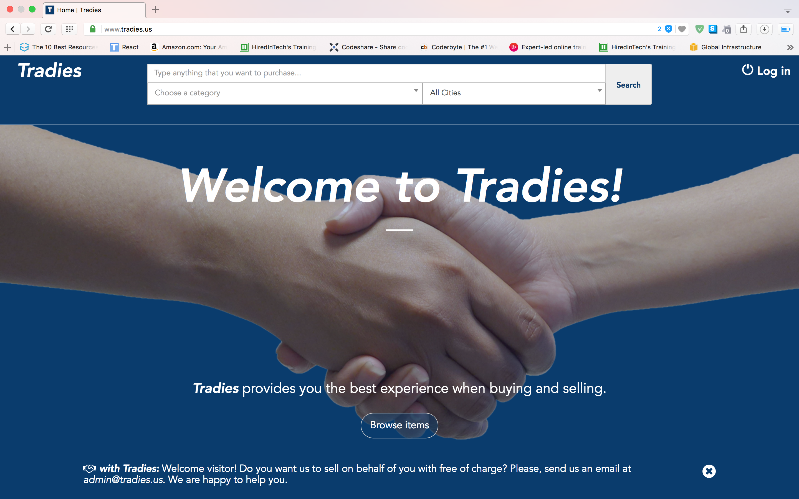
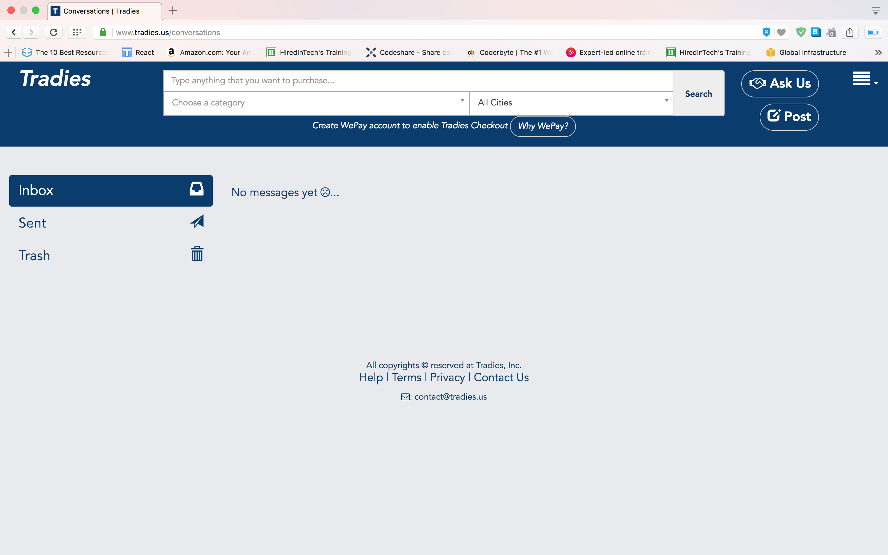

# Tradies
Welcome to my Marketplace or [CtoC ecommerce](https://en.wikipedia.org/wiki/Customer_to_customer) application! 
[Tradies](http://www.tradies.us) is where people go to buy and sell items! I originally built to help friends buy and sell items locally with simple user interface and to learn building a website from scratch. This was my first scalable, full-stack RoR application.



### Tech Stack
* [Ruby on Rails 5](http://weblog.rubyonrails.org/2016/6/30/Rails-5-0-final/) application hosted on [Heroku](https://www.heroku.com).
* Front-end: [Bootstrap 3](https://github.com/twbs/bootstrap-sass/), [jQuery](https://rubygems.org/gems/jquery-rails) for animations, [Select2](https://select2.github.io)
* Back-end: [PostgreSQL](https://www.postgresql.org/) in Development, Staging, and Production stages.
* Mail Server: [SendGrid](https://sendgrid.com)
* Object Storage server: [Amazon S3](https://aws.amazon.com/s3/) used to store profile images.
* Asynchronous Processing (with app server): [Sidekiq](http://sidekiq.org) with [Redis](https://redis.io) applicaiton server
* Search: [Bonsai Elasticsearch](https://www.elastic.co)
* In-app Messaging: [Mailboxer](https://github.com/mailboxer/mailboxer)
* In-app transaction: [WePay](http://wepay.com)
* analytics: [Google analytics](https://www.google.com/analytics/#?modal_active=none)
* App Monitoring: [New Relic](https://newrelic.com)

### Features
The app requires authentication to access. Authentication is executed with email verification (emails sent by [SendGrid](https://sendgrid.com)) and [mailers](app/mailers).

[Asynchronous/Background Processing](https://en.wikipedia.org/wiki/Background_process)
All the mailing are handled by queue implemented in **Redis Server**(Sidekiq sits on top of it) and de-queued consecutively.
There is definitely a bottleneck which will be discussed later.

Upon login, you can search using the search bar at the top:
* [Handling search terms](app/controllers/static_pages_controller.rb)
* [Handling search filters (category and location)](app/controllers/application_controller.rb)
```rb
def beautiful_search_url
  # check this function in the link above
end
```
* in my [Post.rb](app/models/post.rb), I built this function to merge attributes into one for search query.
```rb
def search_data
  attributes.except(:state, :content).merge(
    category_titles: categories.map(&:title)
  )
end
```
[Messaging](app/controllers/messages_controller.rb)
* Users can message between each other.
* Users will be notified via emails that they received messages.



[WePay payment](app/models/post.rb)
* Used WePay API to handle transactions
```rb
# creates a checkout object using WePay API for this user
...
def create_checkout(redirect_uri)
  price = self.price
  app_fee = tradies_app_fee(price)
  params = {
    :account_id => self.user_wepay_account_id,
    :short_description => "item sold by #{self.user_name}",
    :type => :goods,
    # :auto_release => false,
    :currency => 'USD',
    :amount => price,
    :fee => {
        :app_fee => app_fee,
        :fee_payer => 'payee'
    },
    :hosted_checkout => {
        :mode  => 'iframe',
        :redirect_uri => redirect_uri
    }
  }
  ...
...
```
### How my backend works
My database schema design


### Testing
* Used assertion tests and fake users.
* If I were to re-do this project, I would've used more unit tests and make them more reusable between pages.

### Scalability
1) Bottleneck:
* With my current implementation, whenever the web and app servers exceeded their memory and RAM limits, Heroku automatically adds more resources to my servers or increasing  [Dyno](https://blog.logentries.com/2016/04/heroku-dynos-explained/) size. However, this kind of approach or [vertical scaling](https://stackoverflow.com/questions/11707879/difference-between-scaling-horizontally-and-vertically-for-databases) is not a good solution if this site is experiencing an exponential growth because it is **1) not cost-efficient** and **2) will eventually run out of resources**.

Solution:
* Horizontal Scaling:
Instead of adding more resources, add additional servers to handle traffic. Heroku has this feature like adding more dynos at the same or smaller sizes. If I were not to use Heroku, I would have to use load balancers and handle traffic by delivering request to the server that is not currently busy (called [High Availability LB](https://www.howtoforge.com/high-availability-load-balancer-haproxy-heartbeat-debian-etch)).

2) Bottleneck:
* My implementation for background processing w/ Redis server is that I am currently using queue to handle sending emails. There exists a **single point of failure** where it just stops working. In order to prevent this, you can add LB or just implement like the solution above.

### Conclusion
If I do this project again, I will definitely build better automated tests to find any bugs that I would encounter. I think I did not use my time effectively during development. Also, I will definitely have the features that I want to implement written down and create a plan before dive into coding. Since this was my first time building an application in such scale, I did not have a good plan but had a determination and perseverance to complete. Definitely, I sometimes felt like I want to give up but I pushed myself to finish this project.
I have learned a lot from this project which include but not limited to **web architecture, scalability, and building something from the scratch**. I forgot to mention this but don't try to do everything by yourself:)

[Follow me on Twitter](https://twitter.com/Stephen_S_Lee)


MIT License
